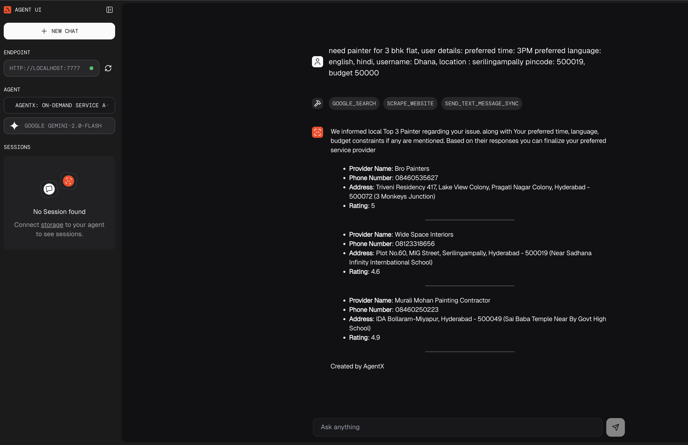
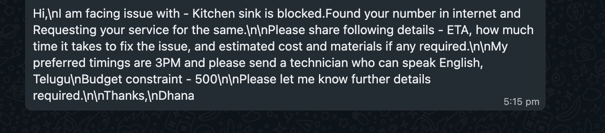

# Project Title
AgentX: On-Demand Service Administrator Powered by Agentic AI

## Overview of the Idea
AgentX is an AI-powered, multimodal assistant that acts as a personalized administrator for booking home services like plumbing, electrical work, carpentry, painting, hair styling, and more. It leverages agentic AI to autonomously handle user requests—understanding issues from chat, images, or videos—matching them with suitable service providers based on real-time preferences and availability. Simply put it could be understood as urban company with Agentic AI.

## Project Goal
The goal is to build an intelligent, autonomous system that demonstrates how agentic AI can streamline service booking by:

- Understanding user needs from natural language and media inputs
- Mapping those needs to verified service providers
- Minimizing user effort through autonomous task execution
- Providing a seamless, localized experience end-to-end

## How It Works

**User Flow**: 

- User prompts chat-based app (including user details like location, pincode, preferences, budget).
- User describes a service need via text, image, or video (e.g., “My kitchen tap is leaking” or uploads a video of the issue).
- The AI agent processes the input, identifies the problem, appliance type, and skill required (e.g., Plumber).
- Search Agent filters providers based on location, price range, time preferences, ratings, and language compatibility.
- Scrape the websites to get the provider information like phone number, ratings etc
- Top 3 providers are sent whatsapp message with details of the required service, preferences etc.
- Based on their responses User selects a provider and books the service

**NOTE:** Can be extended to multimodal inputs like image, audio and video. 
Where the models can interpret the file and decide the service required and the rest of the flow is same.
Session was not maintained for simplicity. 
We can have conversational mode also if the user wants to get different search results and follow-up questions.

**Core Functionality**: 

- Autonomous agent searching and execution
- Real-time provider matchmaking based on multiple criteria
- Localized, personalized service recommendations
- History-aware rebooking and recommendations

 **Multimodal Elements** (if applicable): 
- Text: User input via chat
- Images/Videos: Uploaded by users for diagnosis (NOT implemented but can be extended)
- Voice (optional): For hands-free interaction (NOT implemented but can be extended)

## Tools Used
LLMs - google gemini flash 2 model, 
Agno agent tools - GoogleSearchTools, FirecrawlTools, Twilio for whatsapp messaging
Agno UI for chat 

## UI Approach
Agno UI Chat application

## Visuals
- Run the Playground application on port 7777
- Run the UI application on port 3000
- We can see the agent, model selected and the tool calls that were made in the chat. Session is not maintained for simplicity.
Below screenshot of a sample run
- 

Whatsapp message screenshot:

## Team Information
- **Team Lead**: @marepab Lead
- **Team Members**: Dhanapathi Marepalli
- **Background/Experience**: Java developers aspiring to be AI Engineers

